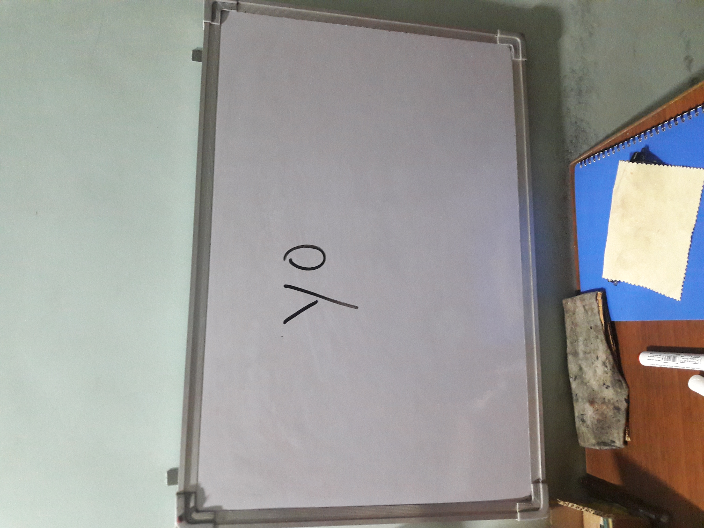

## [Tasks](https://javascript.info/while-for#tasks)

### [Last loop value](https://javascript.info/while-for#last-loop-value)

[](https://javascript.info/task/loop-last-value)

importance: 3

What is the last value alerted by this code? Why?

```javascript
let i = 3;

while (i) {
  alert( i-- );
}
```

---
solution



